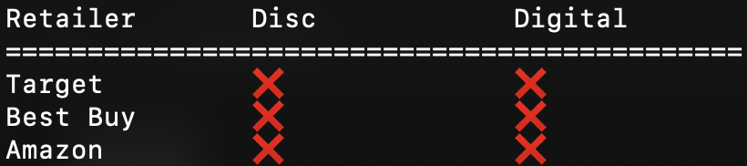

**where-ps5** lets you check for PS5 availability across multiple retailers, instantly, and from the terminal.

## Installation
**where-ps5** is installed with [pipx][1].
```
pipx install git+https://github.com/jonxola/where-ps5.git
```

## Usage
```
whereps5
```


[1]: https://pipxproject.github.io/pipx/